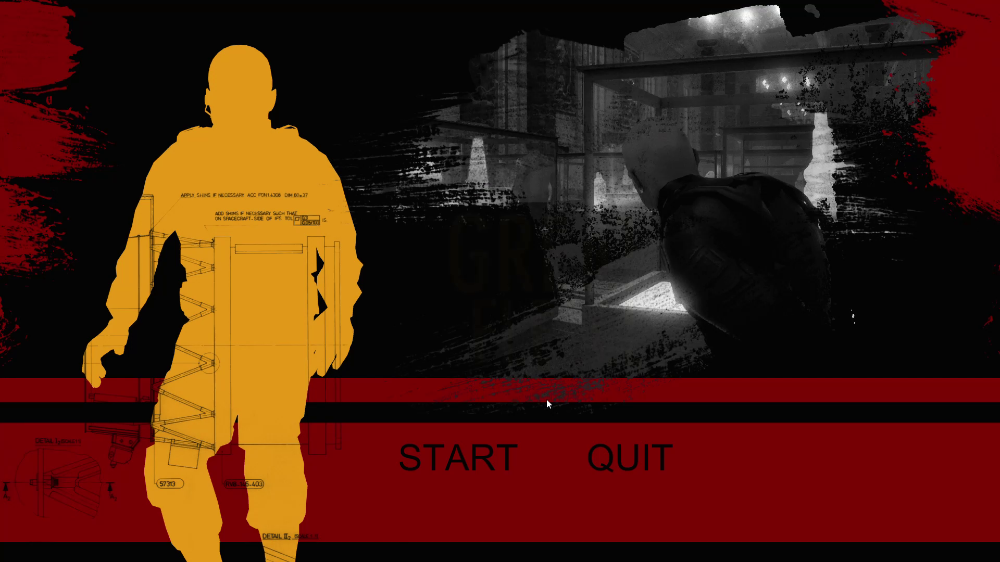
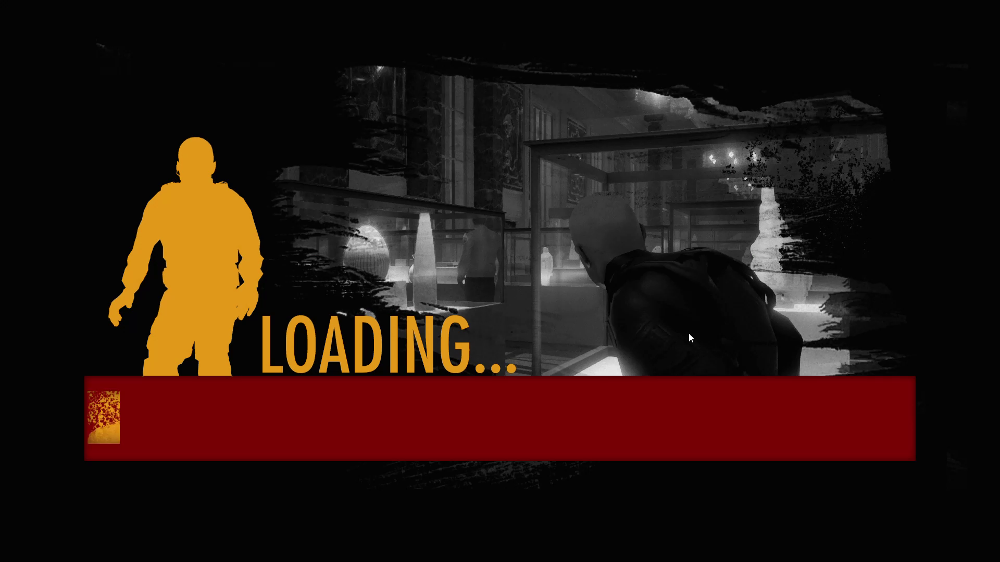
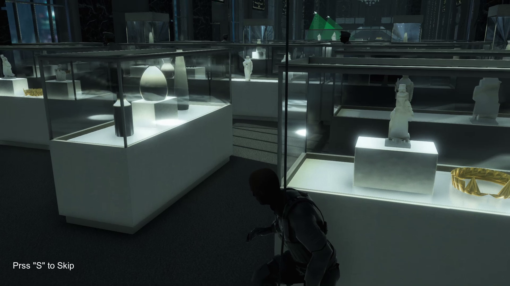
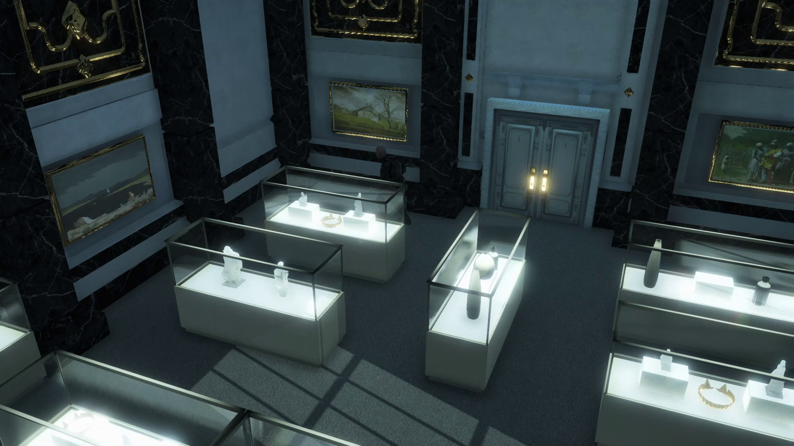
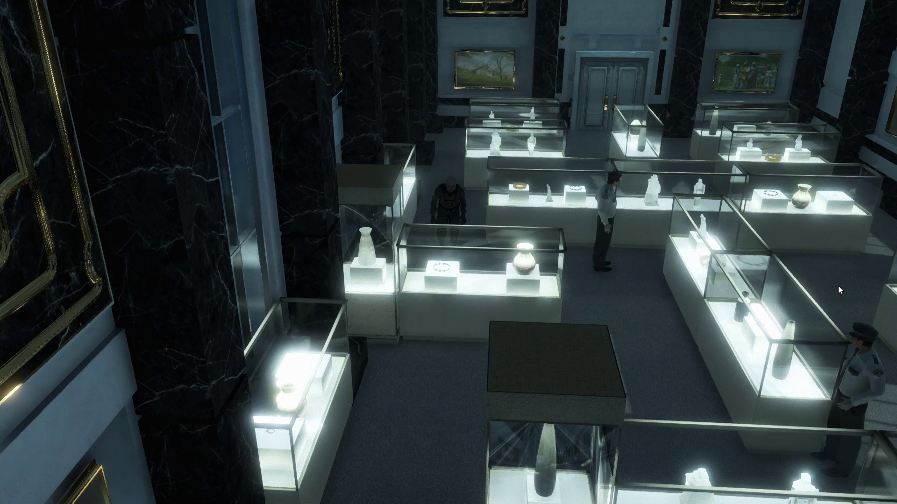
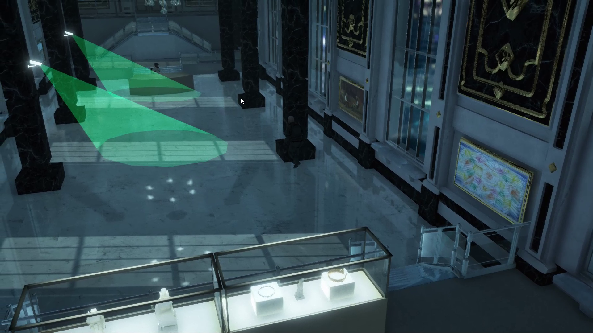
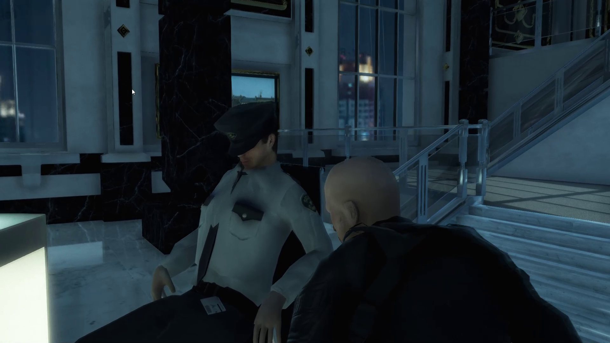
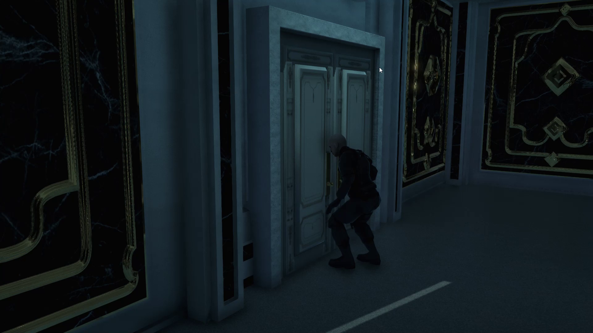
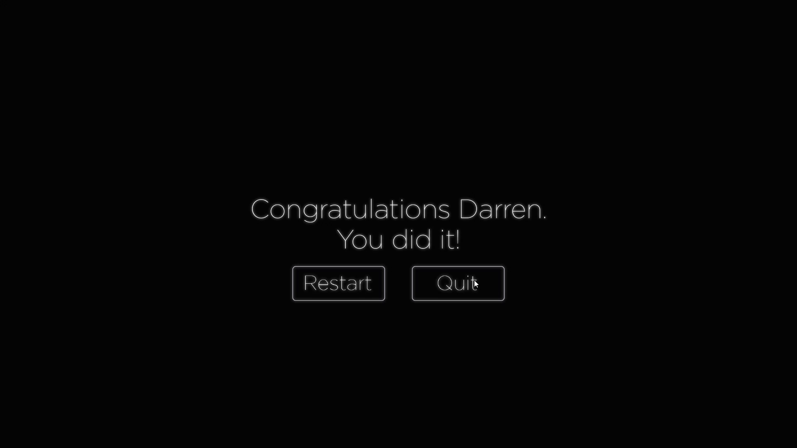

# The Great Fleece
 The Great Fleece is a desktop game, Player is called Darren, he sneaked into an auction house and wants to get into the vault, Oliver is his mate he talks to him to overcome difficulties

## Table of contents
* [General info](#general-info)
* [Controls](#controls)
* [Screenshots](#screenshots)
* [Watch Video](#watch-video)
* [Technologies](#technologies)
* [Setup](#setup)
* [Status](#status)
* [Inspiration](#inspiration)
* [Contact](#contact)

## General info
- Game has several cut-scenes made by cienmachine and timeline, Cut-scenes are:

  - Intro cut-scene
  - Sleeping guard cut-scene
  - Level complete cut-scene
  - Game over cut-scene

- Darren is supposed to bypass the guards and get into the other side to the vault

- Darren should toss a coin in far Location to distract guards

- Darren must not let the security cameras capture him or he will get caught

- Darren should take the vault card from the sleeping guard and get into the vault

## Controls
- Left mouse button to move

- Right mouse button to toss a coin

## Screenshots

- #### Game Main Menu Scene
  

- #### Loading Screen Scene
  

- #### Intro Cut-Scene
  

- #### Game Start
  

- #### Toss a coin
  

- #### Bypass security cameras
  

- #### Take Card From Sleeping Guard
  

- #### Level Complete Cut-Scene
  

- #### Game Over Panel
  

## Watch Video

<iframe width="560" height="315" src="https://www.youtube.com/embed/AmDYRSQhAKU" frameborder="0" allow="accelerometer; autoplay; encrypted-media; gyroscope; picture-in-picture" allowfullscreen></iframe>

## Technologies

* Unity - 2018.3

## Setup

- Download game assets from [unity asset store](https://assetstore.unity.com/packages/templates/tutorials/the-great-fleece-110186)
- Download `Assets Folder` and import it to your game

## Status
The game is made as a learning project

## Inspiration
Project inspired by [The Ultimate Guide to Real World Applications with Unity](https://www.udemy.com/theultimate-guide-to-cinematography-with-unity/) udemy course

## Contact
Created by [Mohamed Abdelnaby Elattar](https://www.linkedin.com/in/maaelattar) - feel free to contact me!
